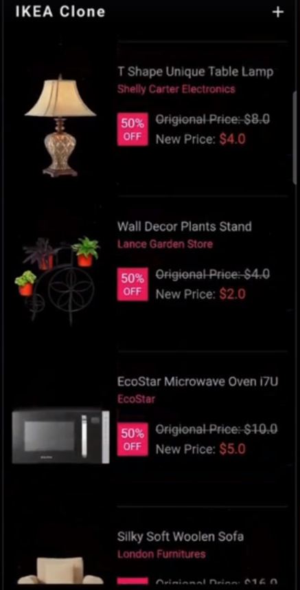
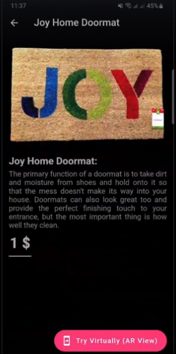
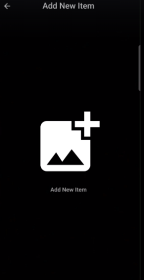
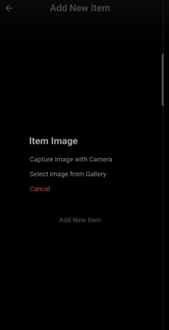
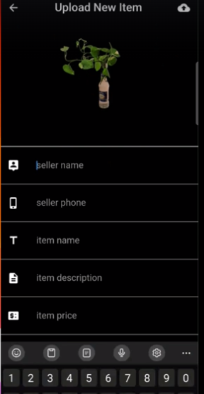

# AR Shopping app like iKEA Place 
Based on an Udemy course: [https://www.udemy.com/course/flutter-ios-android-augmented-reality-ar-ikea-clone-2023/](url)

## What I used
- Dart/Flutter
- Firebase
- Removing Background API

## What this app can do
Choose whatever items you like to display it

Information of a particular item

Display it on camera using AR 

Moreover, users can capture items of their own

